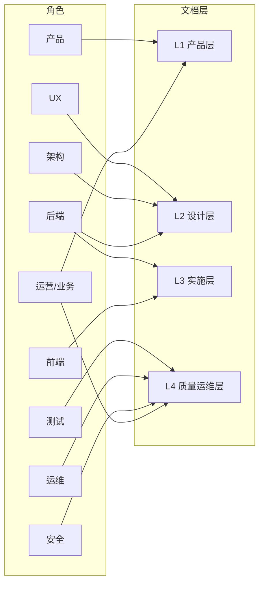

# 企业级软件开发 · 技术文档操作手册

> **读者**：一人多角（产品 + 开发 + 交付）  
> **目的**：搞清「完整技术文档长什么样、谁该负责、你一个人怎么兼」  
> **对照项目**：GEO 多企业 AI 可见度运营平台（`资料/v4/` + `docs/`）  
> **版本**：v1.0 · 2026-07-16

---

## 0. 怎么用这本手册

把企业级研发想成**盖一栋商业楼**：

| 建筑类比 | 软件对应 |
|----------|----------|
| 业主需求书 | PRD / 需求规格 |
| 总平面 + 结构图 | 概要设计 + 架构设计 |
| 水电暖施工图 | API / 数据库 / 目录结构 |
| 监理验收表 | 测试计划 + 验收 AC |
| 物业运维手册 | 部署 / 监控 / 回滚 |
| 开业运营手册 | 录入 checklist / 交付话术 |

**读法建议（一人）：**

1. 先读 **§1 全景图** — 建立「企业里到底有哪些角色」的地图  
2. 再读 **§2 按文档分类** — 知道每份文档写什么、谁主笔  
3. 再读 **§3 按人员分类** — 知道每个角色日常产出什么  
4. 最后读 **§4 一人兼角表** — 你现在该戴哪几顶帽子、哪份文档优先补

---

## 1. 企业级架构全景（角色 × 文档层）

### 1.1 四层文档楼层

```
┌─────────────────────────────────────────────────────────┐
│  L4 质量与运维层  测试计划 · 部署运维 · 安全 · 运营手册   │  ← 能不能上线、怎么保活
├─────────────────────────────────────────────────────────┤
│  L3 实施层        API 契约 · 目录结构 · 实施清单/排期     │  ← 谁来做、何时做完
├─────────────────────────────────────────────────────────┤
│  L2 设计层        概要设计 · 架构 · UX · 数据库/ER        │  ← 怎么做
├─────────────────────────────────────────────────────────┤
│  L1 产品层        PRD · 需求规格 · 客户/老板版介绍        │  ← 做什么、不做什么
└─────────────────────────────────────────────────────────┘
```

**本目录可填模板（复制后删「填写提示」再写正文）：** 见 [README.md](./README.md)

| 层 | 模板 |
|----|------|
| L1 | [L1-PRD.md](./L1-PRD.md)（结构对齐 [`../PRD-v2.md`](../PRD-v2.md)）· [需求规格](./L1-需求规格说明书.md) · [老板版](./L1-产品介绍-客户老板版.md) · [二期](./L1-二期.md) |
| L2 | [概要设计](./L2-概要设计说明书.md) · [架构](./L2-架构设计说明书.md) · [UX](./L2-UX说明.md) · [数据库/ER](./L2-数据库与ER.md) |
| L3 | [API 契约](./L3-API契约.md) · [目录结构](./L3-项目目录结构.md) · [实施清单](./L3-实施清单.md) |
| L4 | [测试验收](./L4-测试计划与验收.md) · [部署运维](./L4-部署运维.md) · [安全](./L4-安全说明.md) · [运营](./L4-运营手册.md) |

### 1.2 核心角色一览

| 角色 | 英文常见叫法 | 一句话职责 | 建筑类比 |
|------|--------------|------------|----------|
| 产品经理 | PM / PO（Product Owner，产品负责人） | 定范围、写验收标准、排优先级 | 业主代表 + 方案设计师 |
| 业务/行业专家 | Domain Expert | 行业真实规则、话术、客户场景 | 懂行的顾问 |
| UX / 交互设计 | UX Designer | 用户流程、页面信息结构 | 室内动线设计师 |
| 架构师 / 技术负责人 | Architect / Tech Lead | 技术选型、系统边界、非功能需求 | 结构工程师 |
| 后端开发 | Backend | API、数据、任务队列、Agent | 水电暖施工 |
| 前端开发 | Frontend | 页面、状态、对接 API | 精装施工 |
| 测试 | QA（Quality Assurance，质量保证） | 用例、验收、回归、边界场景 | 监理 + 竣工验收 |
| 运维 | DevOps / SRE | 部署、监控、备份、发布与回滚 | 物业 + 消防 |
| 安全 | Security | 权限、PII、审计、合规 | 安防系统 |
| 数据 / DBA | DBA（Database Administrator） | ER、索引、迁移、备份恢复 | 地下室管线图 |
| 运营 / 交付 | Ops / CS | 客户录入、上线 checklist、售前话术 | 开业运营 |
| 项目管理 | PM（Project Manager） | 排期、风险、版本基线、文档索引 | 总包项目经理 |

> **RACI 速记**：R = 负责写；A = 最终批准；C = 要被咨询；I = 知会即可。  
> 原则：**谁对上线后果负责，谁当 A（批准人）**。

### 1.3 文档与角色总关系（鸟瞰）



---

## 2. 按技术文档分类

每一行 = **一份企业级文档类型**。  
「GEO 现状」列对照你仓库里已有/缺失的文件。

### 2.1 L1 产品层 — 回答「做什么」

| 文档 | 描述（写什么） | 主笔 R | 批准 A | 必咨询 C | GEO 现状 |
|------|----------------|--------|--------|----------|----------|
| **PRD（产品需求文档）** | 目标用户、问题、MVP 范围、成功指标、不做清单 | 产品 | 产品（或老板） | 业务、架构、运营 | ✅ `资料/v4/PRD-v4.md` |
| **需求规格说明书 SRS** | 功能点 FR（Functional Requirement）+ 验收条件 AC（Acceptance Criteria） | 产品 | 产品 | 开发、测试、UX | ✅ `资料/v4/GEO-需求规格说明书.md` |
| **产品介绍 / 客户版** | 老板可读价值主张 + 录入 checklist | 产品 + 运营 | 产品 | 业务专家 | ✅ `资料/v4/GEO-产品介绍-生美老板版.md` |
| **二期 /  backlog** | 明确「暂不落地」项，防范围膨胀 | 产品 | 产品 | 架构 | ✅ `资料/v4/二期.md` |

**操作要点：**

- PRD 定「方向」；SRS 定「可开发、可测试的条款」——二者不要混成一篇超长文。  
- 每条功能至少配 **1 条 AC**，测试才能据此验收。  
- 改范围时先改 PRD/SRS，再改代码。

---

### 2.2 L2 设计层 — 回答「怎么做」

| 文档 | 描述（写什么） | 主笔 R | 批准 A | 必咨询 C | GEO 现状 |
|------|----------------|--------|--------|----------|----------|
| **概要设计 HLD** | 模块划分、三舱流程、页面/信息结构、状态机概览 | 产品 + UX（或架构） | Tech Lead | 前后端、测试 | ✅ `资料/v4/GEO-概要设计说明书.md` |
| **架构设计说明书** | 技术栈、分层、集成边界、非功能（性能/隔离/限流） | 架构 / Tech Lead | Tech Lead | 后端、运维、安全 | ✅ `资料/v4/GEO-架构设计说明书.md` + `docs/ARCHITECTURE.md` |
| **UI / UX 说明** | 关键页面线框、交互状态（空/错/加载）、闸门动线 | UX | 产品 | 前端、测试 | ⚠️ 多散落在概要设计；可薄拆一页 |
| **数据库说明 / ER** | 表、字段、关系、租户字段、迁移约定 | 后端 / DBA | Tech Lead | 架构、测试 | ✅ `资料/v4/GEO-数据库说明.md` · `GEO-ER-v2.md` |
| **视觉 / Design System** | 颜色、组件规范（已有产品时） | 设计 / 前端 | 产品 | 前端 | ✅ `docs/DESIGN.md`（偏实现约束） |

**操作要点：**

- 架构文档写「边界与约束」，不要写成代码注释堆砌。  
- ER 变更必须走迁移（Alembic），禁止口头改库。  
- 非功能需求（NFR）要可验证：例如「跨租户查询必须 403」。

---

### 2.3 L3 实施层 — 回答「谁来做、何时做完」

| 文档 | 描述（写什么） | 主笔 R | 批准 A | 必咨询 C | GEO 现状 |
|------|----------------|--------|--------|----------|----------|
| **实施清单 / 开发计划** | 里程碑、任务拆分、验收节点、风险 | PM + Tech Lead | 产品 / Tech Lead | 全员 | ✅ `资料/v4/GEO-实施清单.md` · `GEO-7天开发计划.md` |
| **API 契约 / OpenAPI** | 路径、请求响应、错误码、鉴权约定 | 后端（与前端共定） | Tech Lead | 前端、测试 | ⚠️ 部分在 `ARCHITECTURE.md`；建议独立成册或 OpenAPI |
| **项目目录结构** | 代码放哪、命名约定、禁止事项 | Tech Lead | Tech Lead | 开发 | ✅ `资料/v4/GEO-项目目录结构.md` + `docs/ARCHITECTURE.md` §2 |
| **README / 本地启动** | 环境变量、一键起服、常见坑 | 开发 | Tech Lead | 运维 | ⚠️ 按仓库补全 |

**操作要点：**

- API 契约是前后端的「施工图纸」——先对齐再写页面。  
- 实施清单按 **可演示切片**（vertical slice）排，不要按「先写完所有后端」排。

---

### 2.4 L4 质量与运维层 — 回答「能不能上线、怎么保活」

| 文档 | 描述（写什么） | 主笔 R | 批准 A | 必咨询 C | GEO 现状 |
|------|----------------|--------|--------|----------|----------|
| **测试计划** | 测什么/不测什么、环境、优先级 | 测试 | 产品 + Tech Lead | 开发 | ❌ 建议新建 |
| **测试用例表** | 用例 ID ↔ FR/AC、步骤、预期结果 | 测试 | 测试 | 产品 | ❌ 建议从 SRS 的 AC 拆出 |
| **验收清单** | MVP 上线前必过项（含安全 AC） | 测试 + 产品 | 产品 | 运营 | ⚠️ 散落在实施清单 / SRS |
| **部署与运维手册** | 环境拓扑、发布步骤、监控告警 | 运维 | Tech Lead | 后端、安全 | ⚠️ 部分在架构；建议合并 |
| **回滚手册** | 何时回滚、回滚步骤、验收复测 | Tech Lead / 运维 | Tech Lead | 产品 | ✅ `docs/ROLLBACK.md` |
| **安全说明** | 权限模型、PII、审计日志、CSP/sanitize | 安全（或架构代写） | Tech Lead | 产品、运维 | ⚠️ 已写入 SRS/架构条款；可薄拆专章 |
| **运营 / 交付手册** | 客户录入、SEMI 操作、售前话术 | 运营 | 产品 | 业务 | ✅ 老板版 + 实施清单中有片段 |

**操作要点：**

- **没有 AC 的功能 = 不可验收** = 对企业级而言等于没做完。  
- 回滚与发布写在同一本运维手册里最省事（你已有独立 `ROLLBACK.md`，保持交叉链接即可）。

---

### 2.5 文档最小全集（12 类）

企业级「完整」通常至少覆盖这 12 类（小团队可合并文件，但内容不能缺）：

| # | 文档类 | 一人 MVP 可否合并 |
|---|--------|-------------------|
| 1 | PRD | 否（保持独立） |
| 2 | 需求规格 SRS | 否（功能唯一基线） |
| 3 | 概要设计 | 可与 UX 合并 |
| 4 | 架构设计 | 可与目录结构、部分 API 合并 |
| 5 | 数据库 / ER | 可与架构附录合并 |
| 6 | API 契约 | **建议独立**（前后端对齐成本最高） |
| 7 | UI/UX 说明 | 可进概要设计 |
| 8 | 测试计划 + 用例 + 验收 | **建议独立薄文档** |
| 9 | 部署运维 | 可与回滚合并 |
| 10 | 安全说明 | 可从 SRS/架构摘抄成专章 |
| 11 | 实施计划 | 否（排期要单独看） |
| 12 | 运营交付手册 | 可与老板版合并 |

---

## 3. 按人员分类

每个角色：职责 → 主责文档 → 日常动作 → 与你（一人）的对应。

### 3.1 产品（PM / PO）

| 项 | 内容 |
|----|------|
| **职责** | 定义问题与范围；写清 AC；砍需求；对「做对的事」负责 |
| **主责文档** | PRD、SRS、二期清单、验收签字 |
| **日常动作** | 需求评审、优先级排序、演示验收、范围变更记录 |
| **你一人时** | **必须亲自做**；不要把「范围」交给 AI 随意扩 |

### 3.2 业务 / 行业专家

| 项 | 内容 |
|----|------|
| **职责** | 提供真实场景、禁词、话术、行业事实口径 |
| **主责文档** | 行业包素材、客户版 checklist 内容审核 |
| **日常动作** | 评审文案真实性、补 KB 事实、纠正「听起来像但假」的内容 |
| **你一人时** | 用「生美老板访谈 + 竞品页面」代替；写进 KB / 行业包 seed |

### 3.3 UX / 交互

| 项 | 内容 |
|----|------|
| **职责** | 三舱动线清晰；关键状态可见；减少老板认知负担 |
| **主责文档** | 概要设计中的 UX 部分、线框、交互说明 |
| **日常动作** | 流程走查、空状态/错误态设计、闸门交互 |
| **你一人时** | 先画流程图再写页面；参考 PRD 三舱，不做花哨仪表盘堆砌 |

### 3.4 架构师 / Tech Lead

| 项 | 内容 |
|----|------|
| **职责** | 技术选型、分层、红线约束、集成边界、NFR |
| **主责文档** | 架构设计、`ARCHITECTURE.md`、目录结构、回滚策略拍板 |
| **日常动作** | 技术评审、拒不合理依赖、定「禁止破坏」清单 |
| **你一人时** | **戴这顶帽子写红线**（租户隔离、不直调 LLM、不绕过 fact_verify） |

### 3.5 后端开发

| 项 | 内容 |
|----|------|
| **职责** | API、模型、Service、Celery Job、Agent 子图、数据迁移 |
| **主责文档** | API 契约、数据库说明、模块级 README |
| **日常动作** | 按 SRS 实现；写迁移；保证租户过滤；打点日志 |
| **你一人时** | 核心工时所在；先打通「舱1→舱2 闸门①」垂直切片 |

### 3.6 前端开发

| 项 | 内容 |
|----|------|
| **职责** | 三舱页面、鉴权、对接 API、状态与反馈 |
| **主责文档** | 页面与路由说明（可附在概要设计）、前端 README |
| **日常动作** | 按契约联调；统一错误提示；不做页面内裸 fetch |
| **你一人时** | 页面跟 AC 走；复杂图表可后置 |

### 3.7 测试（QA）

| 项 | 内容 |
|----|------|
| **职责** | 把 AC 变成用例；拦回归；给上线放行意见 |
| **主责文档** | 测试计划、用例表、验收清单 |
| **日常动作** | 冒烟 / 回归 / 安全用例（跨租户）；缺陷分级 |
| **你一人时** | 每做完一切片就填「用例表」一行；上线前跑验收清单 |

### 3.8 运维（DevOps）

| 项 | 内容 |
|----|------|
| **职责** | 环境、发布、监控、备份、故障恢复 |
| **主责文档** | 部署手册、监控告警、回滚手册 |
| **日常动作** | Compose / 上云；看 Sentry；Faiss/DB 备份演练 |
| **你一人时** | MVP 用 Docker Compose；回滚步骤写清楚即可 |

### 3.9 安全

| 项 | 内容 |
|----|------|
| **职责** | 鉴权、租户隔离、PII、审计、托管页安全 |
| **主责文档** | 安全说明 / SRS 中 AC-SEC-* |
| **日常动作** | 权限矩阵评审；日志是否可追责；sanitize/CSP |
| **你一人时** | 把安全写成 **AC 条款**（如 AC-SEC-01），测试时必测 |

### 3.10 数据 / DBA

| 项 | 内容 |
|----|------|
| **职责** | 模型正确、索引、迁移安全、备份恢复 |
| **主责文档** | ER、数据库说明、备份策略 |
| **日常动作** | 评审表结构；禁止无迁移改库 |
| **你一人时** | 与后端合并；改表必 Alembic |

### 3.11 运营 / 交付

| 项 | 内容 |
|----|------|
| **职责** | 客户能开起来；录入正确；SEMI 会操作；预期管理 |
| **主责文档** | 运营手册、录入 checklist、售前话术 |
| **日常动作** | 陪跑首客；收集「听不懂」的文案反馈给产品 |
| **你一人时** | 首版用老板版 checklist；每次交付后记一条坑 |

### 3.12 项目管理

| 项 | 内容 |
|----|------|
| **职责** | 排期、风险、版本冻结、文档索引不乱 |
| **主责文档** | 实施清单、README 索引、版本说明 |
| **日常动作** | 周节奏、里程碑演示、基线（v4.1）管理 |
| **你一人时** | 用 `资料/v4/README.md` 当索引；日期+版本写在文档头 |

---

## 4. 一人兼角操作表（给你用的）

企业有 12 个角色；你一个人时，按 **帽子优先级** 兼：

| 优先级 | 帽子 | 必须产出 | 可暂缓 |
|--------|------|----------|--------|
| P0 | 产品 | PRD + SRS（含 AC）+ 二期边界 | 厚调研报告 |
| P0 | Tech Lead | 架构红线 + 目录约定 + 回滚 | 完美微服务拆分 |
| P0 | 后端 + 前端 | 可演示垂直切片 + API 契约草稿 | 全量页面美化 |
| P1 | 测试 | 验收清单（从 AC 抄成勾选表） | 自动化测试大全 |
| P1 | 运营 | 录入 checklist | 完整 CS 体系 |
| P2 | 运维 | Compose 起服 + 备份说明 | 完整 SRE 值班 |
| P2 | 安全 | SRS 安全 AC + 发布前自测 | 渗透报告 |
| P3 | UX / 设计 | 流程图 + 关键页状态 | 完整 Design System |
| — | 独立 PM / 独立 DBA / 独立 Security | — | 团队变大再拆 |

### 4.1 一人推荐文档工作流（每周）

```text
周一：产品帽 — 看 SRS，确认本周切片的 FR/AC
周二–四：开发帽 — 按 AC 实现；同步改 API 契约与 ER（若有）
周五上午：测试帽 — 把本周 AC 勾一遍；记缺陷
周五下午：Tech Lead 帽 — 更新实施清单进度；必要时写回滚备注
交付前：运营帽 — 跑录入 checklist；确认老板话术与指标一致
```

### 4.2 你项目「已有 → 建议补」对照

| 状态 | 文档 |
|------|------|
| ✅ 已有且可用 | PRD-v4、需求规格、概要设计、架构、数据库/ER、实施清单、老板版、ROLLBACK、ARCHITECTURE、DESIGN |
| ⚠️ 建议补薄版 | **API 契约**（从 ARCHITECTURE §4 拆出并随接口更新） |
| ⚠️ 建议补薄版 | **TEST-验收.md**（用例表 = AC 勾选 + 跨租户用例） |
| ⚠️ 建议补薄版 | **OPS-部署.md**（Compose / 环境变量 / 监控入口；链到 ROLLBACK） |
| ❌ 可暂缓 | 独立安全白皮书、完整自动化测试平台文档 |

---

## 5. 协作节奏（企业标准流程 · 缩成一人版）

企业多人时的标准七轮：

| 轮次 | 多人做法 | 你一人做法 |
|------|----------|------------|
| 1 | 产品出 PRD → 业务+架构评审 | 自己写 PRD，隔天用「老板视角」重读砍范围 |
| 2 | SRS 冻结 → 开发+测试评可测性 | 写完 AC 后，问：「我能不能按这句点一点就判定过/不过？」 |
| 3 | 概要+UX → 前后端对齐 | 画三舱流程 + 列出本周页面清单 |
| 4 | 架构+DB → 运维+安全评 | 更新 ARCHITECTURE 红线；改表写迁移 |
| 5 | 排期 → 测试写用例 | 实施清单勾任务；从 AC 生成勾选表 |
| 6 | 开发中 API 与代码同步 | 改接口当天改契约文档 |
| 7 | 测试验收 → 产品签字 → 运营接手 | 自测验收清单 → 跑录入 checklist |

---

## 6. 文档头模板（建议每份都贴）

```markdown
# 文档标题

> **版本**：vX.Y  
> **日期**：YYYY-MM-DD  
> **主笔 R**：角色名  
> **批准 A**：角色名  
> **基线**：对齐 PRD-v4 / 代码 commit ____  
> **状态**：草稿 | 评审中 | 已冻结
```

**冻结规则：** 已冻结的 SRS/架构变更，必须记一条「变更说明」（改了什么、为什么、影响哪些 AC）。

---

## 7. RACI 速查（按文档）

| 文档 | 产品 | UX | 架构 | 后端 | 前端 | 测试 | 运维 | 安全 | 运营 |
|------|------|----|------|------|------|------|------|------|------|
| PRD | R/A | C | C | I | I | I | I | C | C |
| SRS | R/A | C | C | C | C | C | I | C | C |
| 概要设计 | C/A | R | C | C | C | C | I | I | I |
| 架构设计 | C | I | R/A | C | I | I | C | C | I |
| 数据库/ER | I | I | A | R | I | C | C | C | I |
| API 契约 | I | I | A | R | C | C | I | C | I |
| 实施清单 | A | I | R | C | C | C | C | I | C |
| 测试计划/用例 | A | I | C | C | C | R | I | C | I |
| 部署运维 | I | I | A | C | I | I | R | C | I |
| 回滚 | C | I | A | C | I | C | R | C | I |
| 安全说明 | C | I | A | C | I | C | C | R | I |
| 运营手册 | A | I | I | I | I | I | I | C | R |

> 表中 **R/A** = 同一人既写又批（小团队常见）。

---

## 8. 检查清单：你算不算「文档齐全」

一人 MVP「够企业级骨架」的通过线：

- [ ] 有人能从 PRD 说出「做什么、不做什么、成功指标」  
- [ ] 每条核心功能有 FR + AC  
- [ ] 架构红线写清（租户、鉴权、LLM 不直调、发布闸门）  
- [ ] ER / 迁移约定存在  
- [ ] API 有一份前后端共用的契约（哪怕是 Markdown 表）  
- [ ] 有上线验收勾选表（含至少 1 条跨租户安全用例）  
- [ ] 有发布/回滚步骤  
- [ ] 有客户录入 checklist  
- [ ] 二期内容不混进 MVP 基线  
- [ ] `资料/v4/README.md`（或本手册）能当文档索引

---

## 9. 相关路径索引

| 用途 | 路径 |
|------|------|
| 产品基线索引 | `资料/v4/README.md` |
| 产品总纲 | `资料/v4/PRD-v4.md` |
| 功能唯一基线 | `资料/v4/GEO-需求规格说明书.md` |
| 工程架构约束 | `docs/ARCHITECTURE.md` |
| UI 约束 | `docs/DESIGN.md` |
| 回滚 | `docs/ROLLBACK.md` |
| 本手册 | `docs/操作手册.md` |

---

## 10. 一句话收束

企业级不是「文档很多」，而是：**产品说清范围 → 设计说清结构 → 实施说清契约 → 质量说清怎么验 → 运维说清怎么活**。  

角色可以一人兼；**这五层内容不能省**。你现在 GEO 的 v4 基线已覆盖产品与设计层大部分；下一步优先补 **API 契约 + 验收用例表 + 部署说明**，就最接近完整企业级文档骨架。

---

*操作手册 v1.0 · 供一人多角对照企业级研发体系使用 · 随团队扩大再拆角色*
