# GEO 数据库 ER 图 v2

> **版本**：v2.0 | **日期**：2026-07-07 | **关联**：概要设计 v4.1 §12  
> **ORM 路径**：`backend/app/models/`（26 张表；业务域见 `strategy` / `content` / `publish` / `monitor`）  
> **迁移**：`alembic/versions/ac5a7237aec7_initial_schema_v2.py`

---

## 1. 总览

| 分组 | 表数 | 说明 |
|------|------|------|
| 租户 / 门店 | 6 | enterprises + users + brands/stores/services |
| 知识库 KB | 4 | Fact / FAQ / Signal / External |
| 策略 / 内容 / 发布 | 8 | scenario → content_asset → publish |
| 监测 / 诊断 | 3 | monitor_profiles + monitor_results + source_diagnoses |
| Agent / 审计 | 3 | agent_tasks + agent_traces + approval_logs |
| 效果 / 运维 | 2 | outcome_snapshots + hosted_page_events + faiss_indexes |
| 全局配置 | 2 | target_engines + role_permissions |

**本次修订要点：**
- `content_drafts` → **`content_assets`**（发布追踪 content_asset_id）
- 字符串 JSON → **PostgreSQL JSON**（tags / fact_refs / persona_ref 等）
- 补全 **FK**（scenario_id、confirmed_by、human_review_by、content_asset_id）
- 新增 **approval_logs**、**agent_traces**、**source_diagnoses**、**monitor_profiles** 等 P0 表

---

## 2. ER 关系图

```mermaid
erDiagram
    enterprises ||--o{ users : has
    enterprises ||--o| brands : has
    enterprises ||--o{ stores : has
    enterprises ||--o{ services : has

    enterprises ||--o{ kb_facts : owns
    enterprises ||--o{ kb_faqs : owns
    enterprises ||--o{ kb_signals : owns
    enterprises ||--o{ kb_externals : owns
    enterprises ||--o{ keywords : owns

    enterprises ||--o{ scenarios : owns
    enterprises ||--o{ strategy_pack_drafts : owns
    enterprises ||--o{ strategy_packs : owns
    enterprises ||--o{ content_assets : owns
    enterprises ||--o{ publish_tasks : owns
    enterprises ||--o{ monitor_profiles : owns
    enterprises ||--o{ monitor_results : owns
    enterprises ||--o{ source_diagnoses : owns
    enterprises ||--o{ agent_tasks : owns
    enterprises ||--o{ agent_traces : owns
    enterprises ||--o{ approval_logs : owns
    enterprises ||--o{ outcome_snapshots : owns
    enterprises ||--o{ hosted_page_events : owns

    agent_tasks ||--o{ strategy_pack_drafts : produces
    agent_tasks ||--o{ source_diagnoses : produces
    agent_tasks ||--o{ agent_traces : traces

    strategy_pack_drafts ||--o| strategy_packs : confirms_to
    users ||--o{ strategy_packs : confirms

    scenarios ||--o{ content_assets : generates
    scenarios ||--o{ monitor_results : monitors

    content_assets ||--o{ publish_tasks : publishes
    content_assets ||--o{ approval_logs : audited_by
    content_assets ||--o{ hosted_page_events : tracks
    users ||--o{ content_assets : reviews

    source_diagnoses ||--o{ kb_externals : candidates
    monitor_profiles ||--o{ monitor_results : configures
```



---

## 3. 表清单（26 张）

### 3.1 租户中心

| 表 | 关键字段 | 说明 |
|----|----------|------|
| `enterprises` | industry_pack, kb_updated_at, settings(JSON) | 租户根表 |
| `users` | enterprise_id FK, role, email | 成员 |
| `role_permissions` | role, permission | RBAC 全局映射 |
| `brands` | differentiator, slogan | 品牌 / 一句话优势 |
| `stores` | city, district, address, is_primary | 门店 |
| `services` | name, category, status | thin KB 门槛 ≥2 |

### 3.2 知识库

| 表 | 关键字段 | 说明 |
|----|----------|------|
| `kb_facts` | content, verified, tags(JSON) | 发布事实权威 |
| `kb_faqs` | question, answer, source, status, fact_refs(JSON) | FAQ 升格链路 |
| `kb_signals` | signal_type, content, fact_refs(JSON) | RawInput / 监测辅助 |
| `kb_externals` | url, source_platform, source_diagnosis_id FK | 外部信源候选 |

### 3.3 策略 / 内容 / 发布

| 表 | 关键字段 | 说明 |
|----|----------|------|
| `target_engines` | code, capabilities(JSON) | 全局 AI 引擎配置 |
| `scenarios` | user_query, target_engines(JSON), fact_refs(JSON) | 最小生产单元 |
| `strategy_pack_drafts` | job_id FK, payload(JSON), expires_at | onboarding 草案 |
| `strategy_packs` | draft_id FK, confirmed_by FK→users, persona(JSON) | 方案包（闸门①） |
| `content_assets` | scenario_id FK, fact_refs(JSON), human_review_by FK | 内容资产（闸门②） |
| `publish_tasks` | content_asset_id FK, utm_content, fallback_semi | 发布追踪 |
| `keywords` | phrase, pool_hint, status | 词库（监测辅助） |
| `source_diagnoses` | engine, platform_stats(JSON), agent_task_id FK | 信源诊断 |

### 3.4 监测 / Agent / 效果

| 表 | 关键字段 | 说明 |
|----|----------|------|
| `monitor_profiles` | core_prompts(JSON), probe_prompts(JSON), thresholds(JSON) | Core+Probe 配置 |
| `monitor_results` | profile_id FK, scenario_id FK, metrics(JSON), pool_type | 监测结果 |
| `agent_tasks` | graph_name, gate_status, progress_pct | L2 job 状态 |
| `agent_traces` | step_idx, thought, action, observation, langsmith_run_id | Harness 审计 |
| `approval_logs` | content_asset_id FK, action, actor_id FK | 草稿审阅日志 |
| `outcome_snapshots` | metrics(JSON), breakdown(JSON) | 效果舱快照 |
| `hosted_page_events` | content_asset_id FK, event_type, event_at | PV / 表单 |
| `faiss_indexes` | index_name, vector_count, storage_path | 向量索引元数据 |

---

## 4. 关键 FK 一览

```
content_assets.scenario_id          → scenarios.id
content_assets.human_review_by      → users.id
publish_tasks.content_asset_id      → content_assets.id
strategy_packs.confirmed_by         → users.id
strategy_packs.draft_id             → strategy_pack_drafts.id
strategy_pack_drafts.job_id         → agent_tasks.id
monitor_results.scenario_id         → scenarios.id
monitor_results.profile_id          → monitor_profiles.id
kb_externals.source_diagnosis_id    → source_diagnoses.id
source_diagnoses.agent_task_id      → agent_tasks.id
approval_logs.content_asset_id      → content_assets.id
approval_logs.actor_id              → users.id
agent_traces.agent_task_id          → agent_tasks.id
hosted_page_events.content_asset_id → content_assets.id
```

---

## 5. JSON 字段统一（原 String → JSON）

| 表 | 字段 |
|----|------|
| enterprises | settings |
| kb_facts / kb_faqs / kb_signals / kb_externals | tags, fact_refs |
| scenarios | target_engines, persona_ref, competitor_ref, fact_refs |
| strategy_packs / strategy_pack_drafts | persona, competitors, pain_points, scenarios, channels, weights, payload |
| content_assets | fact_refs, fact_verify_report, compliance_report |
| monitor_profiles | target_engines, core_prompts, probe_prompts, thresholds |
| monitor_results | competitor_mentions, metrics |
| source_diagnoses | payload, platform_stats, map_gap |

---

## 6. API 新增

| 方法 | 路径 | 说明 |
|------|------|------|
| GET | `/api/v1/kb/freshness` | KB 新鲜度 + thin KB 门槛 |
| GET | `/api/v1/content/drafts/{id}/approval-logs` | 草稿审阅审计 |

---

## 7. 迁移说明

**新环境：**
```bash
cd backend
alembic upgrade head
```

**旧 SQLite 开发库（含 content_drafts）：** 建议删除本地 `geo_dev.db` 后重建，或手写数据迁移脚本（表名变更 + 字段类型）。

**兼容别名：** ORM 保留 `ContentDraft = ContentAsset`；API 发布接口仍接受 `draft_id` 作为 `content_asset_id` 别名。

---

*ER v2 — 对齐概要设计 v4.1 P0 数据层*
