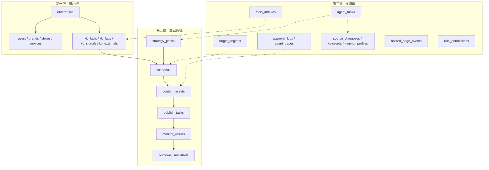

# GEO 数据库说明

> **版本**：v1.1 | **日期**：2026-07-07  
> **关联**：PRD v4 · [GEO-ER-v2.md](./GEO-ER-v2.md)（ER 关系图）  
> **ORM 路径**：`backend/app/models/`（26 张表）

**公共字段约定**（下文不再重复列出）：

| Mixin | 字段 | 说明 |
|-------|------|------|
| `TenantMixin` | `enterprise_id` | 租户 FK → `enterprises.id` |
| `TimestampMixin` | `created_at`, `updated_at` | 创建 / 更新时间 |
| 通用扩展 | `metadata_json` | JSON 扩展字段（ORM 属性名 `metadata_`） |

---

## 1. 划分逻辑（三层）

记成三层即可理解全部 26 张表：

```text
┌─ 第一层：租户根 ─────────────────────────────────────────┐
│  enterprises 为根；带 enterprise_id 的表都挂在其下          │
│  含：成员、门店、知识库                                       │
├─ 第二层：主业务链 ─────────────────────────────────────────┤
│  scenario → content_asset → publish_task → monitor_result  │
│  含：方案包、效果快照（GEO 核心流水线）                        │
├─ 第三层：支撑层 ───────────────────────────────────────────┤
│  Agent job、审计日志、全局引擎配置、向量索引运维                 │
└────────────────────────────────────────────────────────────┘
```



---

### 1.1 第一层：租户根（10 张）

一切业务数据的「地基」。除 `enterprises` 自身和全局 `role_permissions` 外，均含 `enterprise_id`。

#### `enterprises` — 租户根表

| 字段 | 类型 | 说明 |
|------|------|------|
| `id` | int PK | 主键 |
| `name` | string | 企业 / 店名 |
| `industry` | string | 行业标识，默认 `beauty_local` |
| `industry_pack` | string | 行业包（垂域 Skill / KB 模板） |
| `license_no` | string | 营业执照号 |
| `contact_name` | string | 联系人 |
| `contact_phone` | string | 联系电话 |
| `contact_email` | string | 联系邮箱 |
| `status` | string | 租户状态，默认 `active` |
| `plan` | string | 套餐，默认 `mvp` |
| `settings` | JSON | 租户级配置 |
| `kb_updated_at` | datetime | KB 最后更新时间（freshness 黄条） |
| `created_at` / `updated_at` | datetime | 时间戳 |

#### `users` — 成员账号

| 字段 | 类型 | 说明 |
|------|------|------|
| `id` | int PK | 主键 |
| `enterprise_id` | int FK | → `enterprises.id` |
| `email` | string | 登录邮箱（唯一） |
| `phone` | string | 手机 |
| `full_name` | string | 姓名 |
| `hashed_password` | string | 密码哈希 |
| `role` | string | 角色：`admin` / `member` |
| `is_active` | bool | 是否启用 |
| `avatar` | string | 头像 URL |
| `last_login_at` | datetime | 最后登录 |
| `created_at` / `updated_at` | datetime | 时间戳 |

#### `brands` — 品牌信息 ⏳

| 字段 | 类型 | 说明 |
|------|------|------|
| `id` | int PK | 主键 |
| `enterprise_id` | int FK | 租户 |
| `name` | string | 品牌名 |
| `differentiator` | text | 一句话核心优势（开店向导 step5） |
| `slogan` | string | 品牌 slogan |
| `metadata_json` | JSON | 扩展 |
| `created_at` / `updated_at` | datetime | 时间戳 |

#### `stores` — 门店 ⏳

| 字段 | 类型 | 说明 |
|------|------|------|
| `id` | int PK | 主键 |
| `enterprise_id` | int FK | 租户 |
| `name` | string | 门店名 |
| `city` | string | 城市 |
| `district` | string | 区县 |
| `address` | string | 详细地址 |
| `phone` | string | 门店电话 |
| `business_hours` | string | 营业时间 |
| `is_primary` | bool | 是否主店 |
| `metadata_json` | JSON | 扩展 |
| `created_at` / `updated_at` | datetime | 时间戳 |

#### `services` — 服务项目

| 字段 | 类型 | 说明 |
|------|------|------|
| `id` | int PK | 主键 |
| `enterprise_id` | int FK | 租户 |
| `name` | string | 项目名 |
| `description` | text | 项目描述 |
| `category` | string | 分类 |
| `price_hint` | string | 价格区间提示 |
| `duration_minutes` | int | 时长（分钟） |
| `status` | string | 状态，默认 `active` |
| `metadata_json` | JSON | 扩展 |
| `created_at` / `updated_at` | datetime | 时间戳 |

> thin KB 门槛：≥2 条 active `services` + ≥3 条 verified `kb_faqs`。

#### `kb_facts` — 事实层（可发布）

| 字段 | 类型 | 说明 |
|------|------|------|
| `id` | int PK | 主键 |
| `enterprise_id` | int FK | 租户 |
| `title` | string | 标题 |
| `content` | text | 正文（NAP / 项目 / 案例等） |
| `source_type` | string | 来源类型，默认 `manual` |
| `source_ref` | string | 来源引用 |
| `category` | string | 分类 |
| `tags` | JSON | 标签列表 |
| `verified` | bool | 是否已核验 |
| `embedding_id` | string | 向量 ID（Faiss） |
| `metadata_json` | JSON | 扩展 |
| `created_at` / `updated_at` | datetime | 时间戳 |

#### `kb_faqs` — 问答层（审后可发布）

| 字段 | 类型 | 说明 |
|------|------|------|
| `id` | int PK | 主键 |
| `enterprise_id` | int FK | 租户 |
| `question` | string | 问题 |
| `answer` | text | 答案 |
| `category` | string | 分类 |
| `tags` | JSON | 标签 |
| `fact_refs` | JSON | 引用的 Fact ID 列表 |
| `source` | string | 来源，默认 `manual` |
| `status` | string | 状态，默认 `manual` |
| `verified` | bool | 是否已核验 |
| `embedding_id` | string | 向量 ID |
| `metadata_json` | JSON | 扩展 |
| `created_at` / `updated_at` | datetime | 时间戳 |

#### `kb_signals` — 信号层（不可直接发布）

| 字段 | 类型 | 说明 |
|------|------|------|
| `id` | int PK | 主键 |
| `enterprise_id` | int FK | 租户 |
| `signal_type` | string | 信号类型（RawInput / 痛点等） |
| `content` | text | 原始内容 |
| `source` | string | 来源 |
| `confidence` | int | 置信度 |
| `fact_refs` | JSON | 关联 Fact |
| `status` | string | 状态，默认 `pending` |
| `metadata_json` | JSON | 扩展 |
| `created_at` / `updated_at` | datetime | 时间戳 |

#### `kb_externals` — 外部信源候选

| 字段 | 类型 | 说明 |
|------|------|------|
| `id` | int PK | 主键 |
| `enterprise_id` | int FK | 租户 |
| `url` | string | 外部链接 |
| `title` | string | 标题 |
| `source_platform` | string | 平台（小红书 / 知乎等） |
| `content` | text | 抓取正文 |
| `summary` | text | 摘要 |
| `status` | string | 状态，默认 `fetched` |
| `last_fetched_at` | datetime | 最后抓取时间 |
| `fact_refs` | JSON | 确认后关联 Fact |
| `source_diagnosis_id` | int FK | → `source_diagnoses.id` |
| `metadata_json` | JSON | 扩展 |
| `created_at` / `updated_at` | datetime | 时间戳 |

#### `role_permissions` — RBAC 全局映射 ⏳

| 字段 | 类型 | 说明 |
|------|------|------|
| `id` | int PK | 主键 |
| `role` | string | 角色名 |
| `permission` | string | 权限标识 |

> 无 `enterprise_id`，全局配置表。

---

### 1.2 第二层：主业务链（7 张）

GEO 核心流水线：**定场景 → 出内容 → 发布 → 监测 → 看效果**。

```text
strategy_packs（闸门①）
       ↓
scenarios ──→ content_assets（闸门②）──→ publish_tasks ──→ monitor_results
                                                                  ↓
                                                         outcome_snapshots
```

#### `strategy_packs` — 方案包（闸门①）

| 字段 | 类型 | 说明 |
|------|------|------|
| `id` | int PK | 主键 |
| `enterprise_id` | int FK | 租户 |
| `draft_id` | int FK | → `strategy_pack_drafts.id`（可选） |
| `version` | string | 版本号 |
| `status` | string | `draft` / `confirmed` |
| `persona` | JSON | 目标客户画像 |
| `competitors` | JSON | 竞品分析 |
| `pain_points` | JSON | 痛点列表 |
| `scenarios` | JSON | 已选 scenario 快照 |
| `channels` | JSON | 渠道列表 |
| `weights` | JSON | 渠道权重 |
| `confirmed_at` | datetime | 确认时间 |
| `confirmed_by` | int FK | → `users.id` |
| `metadata_json` | JSON | 扩展 |
| `created_at` / `updated_at` | datetime | 时间戳 |

#### `strategy_pack_drafts` — 方案包临时草案 ⏳

| 字段 | 类型 | 说明 |
|------|------|------|
| `id` | int PK | 主键 |
| `enterprise_id` | int FK | 租户 |
| `job_id` | int FK | → `agent_tasks.id` |
| `payload` | JSON | onboarding job 产出全文 |
| `status` | string | 状态，默认 `draft` |
| `expires_at` | datetime | 过期时间 |
| `metadata_json` | JSON | 扩展 |
| `created_at` / `updated_at` | datetime | 时间戳 |

#### `scenarios` — 最小生产单元

| 字段 | 类型 | 说明 |
|------|------|------|
| `id` | int PK | 主键 |
| `enterprise_id` | int FK | 租户 |
| `title` | string | 场景标题 |
| `user_query` | text | 模拟用户问法 |
| `intent` | string | 意图（到店决策 / 项目咨询等） |
| `channel` | string | 目标渠道 |
| `skill` | string | 使用的 Skill |
| `priority` | int | 优先级 |
| `status` | string | 状态，默认 `draft` |
| `target_engines` | JSON | 目标 AI 引擎列表 |
| `persona_ref` | JSON | 画像引用 |
| `competitor_ref` | JSON | 竞品引用 |
| `fact_refs` | JSON | 引用的 Fact ID 列表 |
| `gap_analysis` | text | 缺口分析 |
| `metadata_json` | JSON | 扩展 |
| `created_at` / `updated_at` | datetime | 时间戳 |

> 铁律：**1 scenario × 1 渠道 × 1 Skill**。

#### `content_assets` — 内容资产 / 草稿（闸门②）

| 字段 | 类型 | 说明 |
|------|------|------|
| `id` | int PK | 主键 |
| `enterprise_id` | int FK | 租户 |
| `scenario_id` | int FK | → `scenarios.id`（必填） |
| `title` | string | 标题 |
| `content` | text | 正文 |
| `skill` | string | Skill |
| `channel` | string | 渠道 |
| `fact_refs` | JSON | 引用 Fact |
| `fact_verify_pass` | bool | 事实核验是否通过 |
| `fact_verify_report` | JSON | 事实核验报告 |
| `compliance_pass` | bool | 合规机审是否通过 |
| `compliance_report` | JSON | 合规报告 |
| `machine_review_pass` | bool | 机器审总闸 |
| `human_review_status` | string | 人工审：`pending` / `approved` / `rejected` |
| `human_review_note` | text | 人工审备注 |
| `human_review_by` | int FK | → `users.id` |
| `human_review_at` | datetime | 人工审时间 |
| `version` | int | 版本号 |
| `status` | string | 状态，默认 `draft` |
| `metadata_json` | JSON | 扩展 |
| `created_at` / `updated_at` | datetime | 时间戳 |

> API 兼容别名：`ContentDraft = ContentAsset`。

#### `publish_tasks` — 发布任务

| 字段 | 类型 | 说明 |
|------|------|------|
| `id` | int PK | 主键 |
| `enterprise_id` | int FK | 租户 |
| `content_asset_id` | int FK | → `content_assets.id`（必填） |
| `channel` | string | 发布渠道 |
| `mode` | string | `auto` / `semi` / `guided` |
| `target_url` | string | 目标地址 |
| `published_url` | string | 发布后 URL |
| `published_id` | string | 平台侧 ID |
| `status` | string | `pending` → `publishing` → `published` / `failed` |
| `fallback_semi` | bool | 失败后是否降级 SEMI |
| `retry_count` | int | 重试次数 |
| `error_message` | text | 错误信息 |
| `published_at` | datetime | 发布时间 |
| `utm_content` | string | UTM 追踪参数 |
| `metadata_json` | JSON | 扩展 |
| `created_at` / `updated_at` | datetime | 时间戳 |

#### `monitor_results` — 监测采样结果

| 字段 | 类型 | 说明 |
|------|------|------|
| `id` | int PK | 主键 |
| `enterprise_id` | int FK | 租户 |
| `profile_id` | int FK | → `monitor_profiles.id`（可选） |
| `pool_type` | string | `core`（主攻）/ `probe`（探索） |
| `engine` | string | AI 引擎名 |
| `query` | string | 监测问句 |
| `scenario_id` | int FK | → `scenarios.id` |
| `mentioned` | bool | 是否提及本品牌 |
| `mention_snippet` | text | 提及片段 |
| `trust_score` | float | 信任分 |
| `position_rank` | int | 排名位置 |
| `response_text` | text | AI 完整回复 |
| `competitor_mentions` | JSON | 竞品提及 |
| `metrics` | JSON | 扩展指标 |
| `run_at` | datetime | 执行时间 |
| `batch_no` | string | 批次号 |
| `metadata_json` | JSON | 扩展 |
| `created_at` / `updated_at` | datetime | 时间戳 |

#### `outcome_snapshots` — 效果舱 KPI 快照

| 字段 | 类型 | 说明 |
|------|------|------|
| `id` | int PK | 主键 |
| `enterprise_id` | int FK | 租户 |
| `period` | string | 周期：`day` / `week` / `month` |
| `period_start` | datetime | 周期起始 |
| `period_end` | datetime | 周期结束 |
| `snapshot_type` | string | 快照类型，默认 `dashboard` |
| `metrics` | JSON | KPI 汇总 |
| `breakdown` | JSON | 分渠道 / 分引擎明细 |
| `notes` | text | 备注 |
| `created_at` / `updated_at` | datetime | 时间戳 |

---

### 1.3 第三层：支撑层（9 张）

不直接面向用户操作，但支撑 Agent 执行、审计追溯和系统运维。

#### `agent_tasks` — L2 异步任务

| 字段 | 类型 | 说明 |
|------|------|------|
| `id` | int PK | 主键 |
| `enterprise_id` | int FK | 租户 |
| `task_type` | string | 任务类型 |
| `graph_name` | string | LangGraph 子图名 |
| `celery_task_id` | string | Celery 任务 ID |
| `status` | string | `pending` / `running` / `completed` / `failed` |
| `gate_status` | string | 闸门状态 |
| `progress_pct` | int | 进度百分比 |
| `progress_message` | string | 进度文案 |
| `input_data` | JSON | 输入 |
| `output_data` | JSON | 输出 |
| `trace_id` | string | 追踪 ID |
| `error_message` | text | 错误信息 |
| `started_at` | datetime | 开始时间 |
| `completed_at` | datetime | 完成时间 |
| `created_at` / `updated_at` | datetime | 时间戳 |

#### `agent_traces` — Agent 执行轨迹 ⏳

| 字段 | 类型 | 说明 |
|------|------|------|
| `id` | int PK | 主键 |
| `enterprise_id` | int FK | 租户 |
| `agent_task_id` | int FK | → `agent_tasks.id` |
| `graph_name` | string | 子图名 |
| `step_idx` | int | 步骤序号 |
| `step_name` | string | 步骤名 |
| `thought` | text | ReAct 思考 |
| `action` | string | 执行动作 |
| `observation` | text | 观察结果 |
| `prompt_tokens` | int | Prompt token 数 |
| `completion_tokens` | int | 完成 token 数 |
| `latency_ms` | int | 延迟（毫秒） |
| `langsmith_run_id` | string | LangSmith 运行 ID |
| `metadata_json` | JSON | 扩展 |
| `created_at` / `updated_at` | datetime | 时间戳 |

#### `approval_logs` — 草稿审阅审计（闸门②）

| 字段 | 类型 | 说明 |
|------|------|------|
| `id` | int PK | 主键 |
| `enterprise_id` | int FK | 租户 |
| `content_asset_id` | int FK | → `content_assets.id` |
| `action` | string | 操作：`approve` / `reject` 等 |
| `actor_id` | int FK | → `users.id` |
| `note` | text | 备注 |
| `machine_review_snapshot` | JSON | 机审快照 |
| `metadata_json` | JSON | 扩展 |
| `created_at` / `updated_at` | datetime | 时间戳 |

#### `target_engines` — 全局 AI 引擎注册 ⏳

| 字段 | 类型 | 说明 |
|------|------|------|
| `id` | int PK | 主键 |
| `code` | string | 引擎代码（唯一），如 `doubao` |
| `name` | string | 显示名 |
| `base_url` | string | API 地址 |
| `adapter` | string | 适配器类名 |
| `default_model` | string | 默认模型 |
| `enabled` | bool | 是否启用 |
| `capabilities` | JSON | 能力配置 |

> 无 `enterprise_id`，全局表。

#### `source_diagnoses` — 信源诊断 ⏳

| 字段 | 类型 | 说明 |
|------|------|------|
| `id` | int PK | 主键 |
| `enterprise_id` | int FK | 租户 |
| `engine` | string | 诊断引擎 |
| `batch_no` | string | 批次号 |
| `payload` | JSON | 原始诊断数据 |
| `platform_stats` | JSON | 各平台引用占比 |
| `map_gap` | JSON | 地图 / 信源缺口 |
| `status` | string | 状态 |
| `agent_task_id` | int FK | → `agent_tasks.id` |
| `metadata_json` | JSON | 扩展 |
| `created_at` / `updated_at` | datetime | 时间戳 |

#### `keywords` — 词库（监测辅助）⏳

| 字段 | 类型 | 说明 |
|------|------|------|
| `id` | int PK | 主键 |
| `enterprise_id` | int FK | 租户 |
| `phrase` | string | 关键词 / 短语 |
| `keyword_type` | string | 类型，默认 `exact` |
| `pool_hint` | string | 池提示：`core` / `probe` |
| `status` | string | 状态，默认 `draft` |
| `pain_cluster_id` | string | 痛点聚类 ID |
| `metadata_json` | JSON | 扩展 |
| `created_at` / `updated_at` | datetime | 时间戳 |

#### `monitor_profiles` — 监测配置 ⏳

| 字段 | 类型 | 说明 |
|------|------|------|
| `id` | int PK | 主键 |
| `enterprise_id` | int FK | 租户 |
| `name` | string | 配置名，默认 `default` |
| `target_engines` | JSON | 监测引擎列表 |
| `core_prompts` | JSON | Core 池问句 |
| `probe_prompts` | JSON | Probe 池问句 |
| `thresholds` | JSON | 阈值（提及率 / 连续周等） |
| `is_active` | bool | 是否启用 |
| `metadata_json` | JSON | 扩展 |
| `created_at` / `updated_at` | datetime | 时间戳 |

#### `hosted_page_events` — 托管页事件 ⏳

| 字段 | 类型 | 说明 |
|------|------|------|
| `id` | int PK | 主键 |
| `enterprise_id` | int FK | 租户 |
| `content_asset_id` | int FK | → `content_assets.id` |
| `event_type` | string | `pageview` / `form_submit` 等 |
| `event_at` | datetime | 事件发生时间 |
| `session_id` | string | 会话 ID |
| `payload` | JSON | 事件详情 |
| `created_at` / `updated_at` | datetime | 时间戳 |

#### `faiss_indexes` — 向量索引元数据 ⏳

| 字段 | 类型 | 说明 |
|------|------|------|
| `id` | int PK | 主键 |
| `enterprise_id` | int FK | 租户 |
| `index_name` | string | 索引名 |
| `index_type` | string | 索引类型，默认 `kb_facts` |
| `version` | string | 版本 |
| `vector_count` | int | 向量条数 |
| `storage_path` | string | OSS / 本地路径 |
| `status` | string | 状态，默认 `ready` |
| `last_built_at` | datetime | 最后构建时间 |
| `metadata_json` | JSON | 扩展 |
| `created_at` / `updated_at` | datetime | 时间戳 |

---

### 1.4 三层对照总表

| 层级 | 表数 | 表名 |
|------|------|------|
| **租户根** | 10 | `enterprises`, `users`, `brands`, `stores`, `services`, `kb_facts`, `kb_faqs`, `kb_signals`, `kb_externals`, `role_permissions` |
| **主业务链** | 7 | `strategy_packs`, `strategy_pack_drafts`, `scenarios`, `content_assets`, `publish_tasks`, `monitor_results`, `outcome_snapshots` |
| **支撑层** | 9 | `agent_tasks`, `agent_traces`, `approval_logs`, `target_engines`, `source_diagnoses`, `keywords`, `monitor_profiles`, `hosted_page_events`, `faiss_indexes` |

> ⏳ = 表已建，MVP 代码尚未接入。

---

## 2. 代码模块 ↔ 三舱

| ORM 文件 | 产品舱位 | 对应层级 |
|----------|----------|----------|
| `tenant.py` | 底座 | 租户根 |
| `kb.py` | 舱1 | 租户根 |
| `strategy.py` | 舱1→舱2 | 主业务链 + 支撑层 |
| `content.py` | 舱2 | 主业务链 |
| `publish.py` | 舱3 | 主业务链 |
| `monitor.py` | 舱3 | 主业务链 + 支撑层 |
| `audit.py` | 横切 | 支撑层 |
| `events.py` | 舱3 | 支撑层 |
| `ops.py` | 横切 | 支撑层 |

---

## 3. 关键外键

```text
content_assets.scenario_id          → scenarios.id
content_assets.human_review_by      → users.id
publish_tasks.content_asset_id      → content_assets.id
strategy_packs.confirmed_by         → users.id
strategy_packs.draft_id             → strategy_pack_drafts.id
strategy_pack_drafts.job_id         → agent_tasks.id
monitor_results.scenario_id         → scenarios.id
monitor_results.profile_id          → monitor_profiles.id
kb_externals.source_diagnosis_id    → source_diagnoses.id
source_diagnoses.agent_task_id      → agent_tasks.id
approval_logs.content_asset_id      → content_assets.id
approval_logs.actor_id              → users.id
agent_traces.agent_task_id          → agent_tasks.id
hosted_page_events.content_asset_id → content_assets.id
```

---

## 4. MVP 活跃表（15 张）

```
enterprises, users, services
kb_facts, kb_faqs, kb_signals, kb_externals
scenarios, strategy_packs, content_assets
publish_tasks, monitor_results, agent_tasks
approval_logs, outcome_snapshots
```

---

## 5. 迁移与文件索引

```bash
cd backend && alembic upgrade head
```

```
backend/app/models/
├── tenant.py     # 租户根（6）
├── kb.py         # 知识库（4）
├── strategy.py   # 策略 + Agent（7）
├── content.py    # 内容（1）
├── publish.py    # 发布（1）
├── monitor.py    # 监测 + 效果（3）
├── audit.py      # 审计（2）
├── events.py     # 事件（1）
├── ops.py        # 运维（1）
└── __init__.py
```

---

*GEO 数据库说明 v1.1 — 三层划分 · 全表字段*
