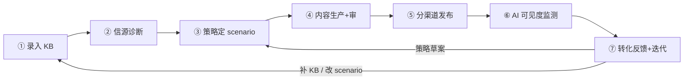

# GEO 智能品牌平台 — 需求规格说明书 v4

> **版本**：V4.1 | **日期**：2026-07-04 | **状态**：产品定稿基线（已吸收 `优化.md`）  
> **取代**：`v2/GEO-需求规格说明书.md`（v2.5）；v2 目录保留不动  
> **关联**：`PRD-v4.md` · `GEO-架构设计说明书.md` · `GEO-概要设计说明书.md` · `GEO-实施清单.md`

---

## 0. 文档说明

### 0.1 本文定位

| 文档 | 回答什么问题 |
|------|-------------|
| **本文 v4** | 做什么、为谁做、怎么闭环、验收标准、版本边界 |
| PRD-v4 | 产品叙事、锚点、三舱、版本摘要 |
| 架构/概要/实施 | 怎么做、排期、工程细节 |

### 0.2 v4 相对 v2 的整理

1. **补齐转化闭环**：从「只盯 AI 提及」到「可见度 → 信任 → 咨询/到店 → 下一轮写什么」全链路写清，并标注 MVP / V1.1 分界。  
2. **统一生产单元**：全篇以 **scenario（场景问题）** 为最小生产单元，篇数 = 场景数，消除「按渠道铺量」歧义。  
3. **词库角色降级**：KeywordLibrary（词库）= 监测槽位 + 标题辅助，**不是** SEO 中心。  
4. **信任资产分层**：MVP 用现有 Fact（Cases/FAQs/NAP）；V1.1 独立 trust_asset 产线。  
5. **KB 厚度/gap**：MVP 仅 freshness（新鲜度）黄条；V1.1 厚度分 + gap 阻断硬生成。  
6. **需求编号统一**：`FR-{模块}-{序号}`，验收 `AC-{序号}`，便于排期与测试对齐。

---

## 1. 产品锚点

### 1.1 第一性原理

> 面向**特定目标人群**，匹配**真实问答场景**，输出**信息增量**与**差异化价值**，建立**品牌专业信任**，完成**咨询与成交转化**。

**价值公式：** 内容价值 ≈ 信息增量 × 品牌信任度  
**North Star（北极星指标）：** AI 信任资产 → 分渠道可见度 → 可验证转化（**非**软文铺量工厂）

### 1.2 产品定义

**GEO（Generative Engine Optimization，生成式引擎优化）** = 让豆包/DeepSeek/Kimi/文心等 AI 在回答用户问题时，能**引用、采信**企业真实品牌信息。

| 维度 | 说明 |
|------|------|
| 产品形态 | 多租户 GEO SaaS（Software as a Service，软件即服务） |
| MVP 行业 | 生美垂直包 `beauty_local`（生活美容/皮肤管理） |
| 差异化 | KB 零幻觉 · 先选 AI 再测信源 · scenario 分渠道 · Core/Probe 双池监测 |
| 不是什么 | 软文工厂、保证排名第一、虚构品牌、刷好评、关键词堆砌 |

### 1.3 明确不做（全版本边界）

| 不做 | 原因 |
|------|------|
| 保证 AI 排名第一 | 不可控、易误导客户 |
| 刷好评 / 虚构品牌进榜单 | 合规与品牌风险 |
| 完整 CMS（内容管理系统） | MVP 仅托管页 + 渠道适配 |
| Neo4j 知识图谱 | MVP 用 PG + Faiss 足够 |
| MVP 全网负面监测与对冲 | 复杂度高，V2+ 评估 |
| 租户侧自建爬虫 | 用 AI 联网 API + 白名单轻抓 |

---

## 2. 目标用户与核心场景

### 2.1 用户画像（MVP）

| 角色 | 典型身份 | 核心诉求 |
|------|----------|----------|
| **Owner（店主/负责人）** | 生美门店老板 | 顾客问 AI 时能被提到；少操心、敢用文案 |
| **Admin（管理员）** | 运营负责人 | 建库、确认方案、发布、看效果 |
| **Editor（编辑）** | 文案/助理 | 改稿、处理机器审告警 |
| **Viewer（查看者）** | 投资人/顾问 | 只看报告，不可改 |

### 2.2 典型场景（User Story 摘要）

| ID | 作为… | 我想… | 以便… |
|----|-------|-------|-------|
| US-01 | 店主 | 一次填完店信息并点「开始分析」 | 系统自动测信源、挖痛点、看竞品，不用逐步点 |
| US-02 | 店主 | 在一页方案包里勾选 2～3 个顾客真实问题 | 只写对转化有用、有 KB 依据的内容 |
| US-03 | 店主 | 审一遍系统生成的 FAQ/小红书稿 | 确认事实无误再发布 |
| US-04 | 店主 | 在效果舱看 AI 是否提到我、网页是否被引用 | 知道钱花在哪、要不要调整 |
| US-05 | 运营 | KB 改价/改项目后收到提示 | 不会静默用旧策略写错价 |
| US-06 | 运营 | 监测 2 周提及率过低时收到策略建议草案 | 人确认后再改方向，而非系统自作主张 |

### 2.3 行业扩展路线

| 版本 | 行业 | 说明 |
|------|------|------|
| MVP | `beauty_local` | 本地生活、高 FAQ 需求、合规敏感 |
| V2 | `b2b_manufacturing` | 深度内容、选型指南、采购链 persona |

### 1.4 可量化指标（MVP 运营）

| 指标 | 口径 |
|------|------|
| Core 提及率 | 主攻 engine；Core 含 confirmed 词库 + **已选 scenario 问法** |
| 托管页表单数 | hosted_page_events.form_submit / 周 |
| 单店闭环天数 | onboarding 提交 → 首次 published → 效果舱首轮 monitor 完成 |

---

## 3. 转化闭环（核心）

> 类比建筑：**KB 是地基**，**scenario 是房间功能**，**渠道是出入口**，**监测是验收**，**转化反馈是下一轮改图依据**。

### 3.1 闭环七段



| 阶段 | 用户感知（三舱） | 系统动作 | 产出 | 人闸门 |
|------|------------------|----------|------|--------|
| ① 录入 | 舱1 开店向导 | 表单 + RawInputs + TargetEngines | KB Fact/Signal | 提交前自检 |
| ② 诊断 | 舱1 进度条 | source_diagnose → pain/keyword → persona → competitor | 诊断报告 + 方案包草案 | 无 |
| ③ 策略 | 舱2 方案包 | 勾选 scenario + 渠道权重 → PLAN | content_unit[] | **闸门① 确认并生成** |
| ④ 生产 | 舱2 草稿列表 | EXECUTE Skills → 机器审 | draft 内容资产 | **闸门② 草稿通过** |
| ⑤ 发布 | 舱3 | AUTO/SEMI/GUIDED | published + content_asset_id | 一键发布 |
| ⑥ 监测 | 舱3 KPI | Core/Probe weekly + 发布后 24h 复测 | 提及率、信源露出 | 无 |
| ⑦ 迭代 | 舱3 建议入口 | 临界规则 /（V1.1）ConsultLog 归因 → gap_analyze 草案 | StrategyUpdateDraft | 人确认后重跑 |

### 3.2 转化归因（Conversion Attribution，转化归因）

**原则：** MVP 不做大厂多触点模型；用「内容 ID + 时间窗口 + 人确认」跑通闭环。

| 能力 | MVP | V1.1 |
|------|-----|------|
| 托管页 PV / 表单 | ✅ 自动 | ✅ |
| 发布记录带 `content_asset_id` | ✅ | ✅ |
| 渠道+日期关联 | ✅ publish_tasks | ✅ |
| ConsultLog（咨询录入） | ❌ | ✅ 老板填或导入 |
| 「高提及零咨询」策略建议 | 文案提示 | ✅ 自动草案 |
| 多触点归因算法 | ❌ | ❌ V2 评估 |

**MVP 最小归因逻辑：**

```
同一 content_asset 发布后 7 天内：
  托管页表单 ↑ 或 老板标记「来自 AI/小红书」→ 记为 positive_signal
  AI 提及率高 + 零表单 + 零咨询记录 → 效果舱提示「补 trust 类内容（案例/FAQ）」
```

### 3.3 闭环铁律

1. **无 Fact 不发布** — 正文必须挂 `fact_refs`，fact_verify 失败拒发。  
2. **篇数 = scenario 数** — 默认 ≤5，不是「小红书 5 篇」。  
3. **未人审不 ready** — draft → ready → published。  
4. **临界只出草案** — 监测触发 gap_analyze，**人确认**后才改策略/重生成。  
5. **学偏好不学事实** — V2+ 偏好学习不得自动改 KB 或发布。

---

## 4. 用户旅程：三舱 UX

> 对外 **3 步**；对内 Orchestrator（编排器）管道不变。用户 **2 次确认闸门**。

### 4.1 三舱对照

| 舱 | 路由 | 用户说 | 系统后台 |
|----|------|--------|----------|
| **舱1 懂我** | `/onboarding` | 告诉我店的信息 | 建库 → 诊断 → 痛点/词库 → 画像 → 竞品 |
| **舱2 定方案** | `/strategy-pack` | 看方案、确认出稿 | PLAN → EXECUTE → 机器审 → **草稿审** |
| **舱3 出结果** | `/outcomes` | 发布、看效果 | 发布 → 监测 → 效果舱 → 迭代入口 |

### 4.2 Step 1 · 开店向导（Onboarding Wizard）

**6 步表单 → 一次提交 → 异步 job 链 → 跳转方案包**

| 步 | 字段 | 写入 KB |
|----|------|---------|
| 1 | TargetEngines 主攻/次攻 | `target_engines[]` |
| 2 | 品牌 / 门店 NAP / 项目价格 | Fact: Brand, Stores, Services |
| 3 | 目标客户（行业模板多选） | persona 种子 |
| 4 | 竞品 2～3 家 + 可选链接 | Competitors[] |
| 5 | 一句话核心优势 | `brand.differentiator` |
| 6 | RawInputs 粘贴（客服/评价/FAQ 草稿） | Signal |

**触发：** `POST /onboarding/run` → `DIAGNOSE → PAIN → KEYWORD → PERSONA → COMPETITOR`  
**进度：** SSE 或轮询；100% 跳转 `/strategy-pack?draft=1`

| 编号 | 需求 | 优先级 |
|------|------|--------|
| FR-UX-01 | 6 步表单向导，支持保存草稿 | P0 |
| FR-UX-02 | onboarding/run 触发 LangGraph `onboarding_graph` 线性 job 链 | P0 |
| FR-UX-03 | 进度 SSE/轮询；**分步叙事**（当前步骤名+预计剩余时间）；失败可重试 | P0 |
| FR-UX-04 | 完成后自动跳转方案包并加载 draft | P0 |

### 4.3 Step 2 · 方案包 + 草稿审

#### 4.3.1 方案包 Strategy Pack（合并原策略方向页 + 信源权重页）

| 区块 | 来源 Skill | 用户操作 | 说明 |
|------|-----------|----------|------|
| **A 画像** | persona_analyze | 确认 primary persona + content_layout_plan | 人群→内容类型→渠道→转化路径 |
| **B 竞品** | competitor_content_analyze | 确认/编辑 differentiation_brief | 非从零手写 |
| **C 场景** | pain + campaign + 差异化 | **勾选 2～5 个 scenario** | **生产单元** |
| **D 渠道** | source_weight_builder | 调 weight；每渠道承接 scenario 数 | 篇数总和 = C 区勾选数 |
| **E 展开** | keyword_mine + freshness | 词库删改确认；KB 黄条 | 默认折叠 |

**关键交互：**

- `[确认并生成草稿]` → `POST strategy-pack/confirm` → **闸门①** → GAP_ANALYZE → PLAN → EXECUTE  
- 同页草稿 Tab：machine_review 结果 + 单条/批量 `[通过]` → **闸门②** → ready

| 编号 | 需求 | 优先级 |
|------|------|--------|
| FR-UX-05 | GET strategy-pack/draft 聚合 A～E 五区块 | P0 |
| FR-UX-06 | POST confirm 触发 PLAN+EXECUTE；Pydantic `extra=forbid` | P0 |
| FR-UX-07 | 草稿列表同页；bulk-approve → ready | P0 |
| FR-UX-08 | D 区「本渠道承接 scenario 数」默认自动分配，总和 = len(selected_scenarios) | P0 |
| FR-UX-09 | 原策略方向/信源权重**不单独路由**（API 保留供专家模式） | P0 |
| FR-UX-10 | KB freshness 黄条：KB 晚于上次诊断/策略时提示 | P0 |
| FR-UX-15 | 方案包**渐进披露**：默认 A+C+主按钮；B/D「展开高级」 | P0 |
| FR-UX-16 | 草稿审**三栏**：预览 \| fact_refs 来源 \| 机器审告警 | P0 |

#### 4.3.2 scenario 与 content_unit

**scenario（场景问题）** = 顾客会问 AI 的一句完整问法，如「敏感肌能不能做皮肤管理」。

```yaml
content_unit:                    # 策略输出；每篇 = 1 scenario × 1 渠道 × 1 Skill
  core_intent: pain | campaign | differentiation
  scenario: "敏感肌能不能做皮肤管理"
  channel: xiaohongshu
  topic_angle: "专业科普"
  target_persona: "hesitant_new"
  fact_refs: ["service:03", "faq:12", "case:01"]
  output:
    skill: beauty_xhs_note
    publish_mode: SEMI          # AUTO | SEMI | GUIDED
```

**Orchestrator PLAN 规则：**

```
选题池 = campaign(优先) + selected_pain_scenarios + differentiation_scenarios
按 source_weight_plan 将 scenario 分配到渠道
约束：每 content_unit 恰好 1 scenario + 1 channel + 1 skill
```

### 4.4 Step 3 · 效果舱 Outcome Dashboard

| 指标 | MVP | V1.1 |
|------|-----|------|
| 品牌提及率（Core） | ✅ | ✅ |
| 信源露出率（Core） | ✅ | ✅ |
| 托管页 PV / 表单 | ✅ | ✅ |
| 各渠道发布状态 AUTO/SEMI/failed | ✅ | ✅ |
| ConsultLog + 简化归因 | ❌ | ✅ |
| 临界策略建议入口 | ✅ | ✅ + 高提及零咨询 |

| 编号 | 需求 | 优先级 |
|------|------|--------|
| FR-UX-11 | GET outcomes 聚合 AI KPI + 发布 + 托管页 | P0 |
| FR-UX-12 | ready 资产一键发布入口 | P0 |
| FR-UX-13 | 策略建议卡片：链到 gap_analyze 草案确认 | P0 |
| FR-UX-14 | ConsultLog 录入 + 按 content_asset 简化归因 | V1.1 |

---

## 5. 知识库（KB）

### 5.1 设计原则

- KB = **对外发布事实的唯一权威（Single Source of Truth）**
- 三层：**Fact（可发布）** / **Signal（线索，不可直接发布）** / **External（外部候选，确认后升格）**
- 写入 Fact **须人确认**（含 Agent 生成回写）
- 生成正文主链：`fact_refs → kb_fetch(按 ID)` — 可追溯、可 fact_verify

### 5.2 数据模型

```
Enterprise (tenant)
├── TargetEngines[]          # 主攻/次攻 AI
├── Brand / Stores[] / Services[] / Cases[] / Competitors[]
├── FAQs[]                   # Fact：标准问答
├── RawInputs[]              # Signal：粘贴的客服/评价
├── KeywordLibrary[]         # 已确认监测词
├── ExternalCandidates[]     # 诊断/SEO 反推，确认后入词库或 Fact
└── meta: kb_updated_at, kb_revision
```

### 5.3 功能需求

| 编号 | 需求 | 优先级 |
|------|------|--------|
| FR-KB-01 | Brand/Store/Service CRUD；NAP 完整校验 | P0 |
| FR-KB-02 | RawInputs 粘贴 + Signal 标注；**录入页 PII 脱敏提示** | P0 |
| FR-KB-03 | TargetEngines 主攻/次攻 | P0 |
| FR-KB-04 | FAQs[] CRUD（Q/A/fact_refs）；手工 + 从 Raw 升格 | P0 |
| FR-KB-05 | content_faq 审核通过后回写 FAQs[]（source=generated） | P0 |
| FR-KB-06 | KeywordLibrary：Agent 出词草案 → 用户删改确认 | P0 |
| FR-KB-07 | 任意 Fact/Signal/FAQ 变更刷新 `kb_updated_at` | P0 |
| FR-KB-08 | GET /kb/freshness：供方案包 E 区黄条 | P0 |
| FR-KB-09 | SEO/问答 API → ExternalCandidates | **P1**（MVP 用 RawInputs+diagnose 反推，见二期 II-06） |
| FR-KB-10 | SeedKeywords 可选加速 | P1 |
| FR-KB-11 | 文件上传 MinIO/OSS | P1 |
| FR-KB-12 | 链接录入 / 店名自动补全 | V1.1（二期 II-12） |
| FR-KB-15 | **thin KB 硬门槛**：无 ≥2 Services 且 FAQs<3 → 禁用「确认并生成」，引导补 KB | P0 |
| FR-KB-16 | RawInputs **数据分级**说明（Signal 不可发布；日志脱敏） | P0 |
| FR-KB-13 | **KB 厚度评分** + 低分阻断批量生成 | V1.1 |
| FR-KB-14 | **trust_asset 产线**（case_builder / faq_from_raw → Fact） | V1.1 |

### 5.4 KB 厚度与 gap（V1.1 详解）

**KB 厚度（KB Thickness）** = 知识库「饱满度」，防止 thin KB（薄库）硬生成水稿。

| 检查项 | 建议阈值 |
|--------|----------|
| 门店 NAP 完整 | 必填 |
| ≥3 个项目含价格/时长 | |
| ≥2 条可发布案例 | |
| ≥5 条 FAQ | |
| ≥10 条 RawInputs | |
| 竞品录入 | ≥2 |

**content_gaps（内容缺口）** = 信源诊断显示 AI 常引某类信息，但 KB 里没有 → Orchestrator 优先补该类 trust 内容。

---

## 6. 信源诊断与策略分析

### 6.1 信源诊断 source_diagnose

**做法：** 调各 AI **官方联网 Chat API**（非租户自建爬虫）→ 解析 citations → 平台分布。

```
输入: TargetEngines + KB(城市/品牌/项目) + engines.json 模板
处理: 每 engine 5～10 条 prompt（local/intent/brand/compare）
输出: platform_stats, map_gap, 高引用问法 → External/Probe 候选
```

| 编号 | 需求 | 优先级 |
|------|------|--------|
| FR-DG-01 | probe_prompt_builder：模板填槽 | P0 |
| FR-DG-02 | EngineAdapter：豆包/DeepSeek/Kimi/文心联网 API | P0 |
| FR-DG-03 | citation 解析 → normalize_url → platform_stats | P0 |
| FR-DG-04 | map_gap：本地类 prompt 无地图/POI → true | P0 |
| FR-DG-05 | 诊断结果可视化（方案包 D 区只读引用） | P0 |
| FR-DG-06 | 密钥平台侧注入；按 tenant 配额 | P0 |
| FR-DG-07 | **诊断默认仅主攻 engine 全量**；次攻可配置降频/跳过（降 LLM 成本） | P0 |

### 6.2 痛点与词库

**数据源优先级：**

| 来源 | MVP |
|------|-----|
| RawInputs | ✅ |
| SEO/问答 API | ✅ |
| source_diagnose 反推 | ✅ |
| 手动补充 | ✅ |
| 定向爬虫 | V1.2 |

**聚类管道（beauty_pain_mine / keyword_mine 共用）：**

```
exact 去重 → embedding → Faiss 相似合并(≥0.85, per-tenant) → LLM 簇命名
→ pain_clusters[] + KeywordLibrary draft
```

| 编号 | 需求 | 优先级 |
|------|------|--------|
| FR-PA-01 | Faiss per-tenant 聚类服务 | P0 |
| FR-PA-02 | beauty_pain_mine → pain_clusters | P0 |
| FR-PA-03 | keyword_mine + SEO API → 词库草案 | P0 |
| FR-PA-04 | 词库确认后仅作监测槽位 + 标题/summary 槽，**不作生产起点** | P0 |

### 6.3 用户画像 persona_analyze（MVP P0）

| 编号 | 需求 | 优先级 |
|------|------|--------|
| FR-PE-01 | 输入：行业包 + KB + RawInputs + 用户角色模板 | P0 |
| FR-PE-02 | 输出 buyer_personas[]：role, pain_tags, decision_stage, trust_triggers | P0 |
| FR-PE-03 | 输出 content_layout_plan[]：人群→内容类型→渠道→转化路径 | P0 |
| FR-PE-04 | 方案包 A 区确认 primary persona | P0 |

### 6.4 竞品分析 competitor_content_analyze（MVP P0）

| 通道 | 做法 |
|------|------|
| A AI 对比探测 | compare 模板 × 竞品名 → EngineAdapter |
| B 公开页轻抓 | 用户提交点评/小红书 URL（白名单）→ 摘要进 External |

| 编号 | 需求 | 优先级 |
|------|------|--------|
| FR-CO-01 | AI 对比探测 → competitor_topics[] | P0 |
| FR-CO-02 | 白名单 page_fetch（competitor_graph ReAct） | P0 |
| FR-CO-03 | 输出 differentiation_brief[] 草案 + content_gaps[] | P0 |
| FR-CO-04 | 方案包 B 区确认/编辑 angle | P0 |
| FR-CO-05 | 不做全网爬虫；**仅用户提交 URL**；抓取日志留痕 | 边界 |

### 6.5 渠道权重 source_weight_builder

```
cite_share（诊断结果）→ 渠道 weight（用户可调，归一化）
scenario 分配：每渠道「承接几个 scenario」；默认自动；总和 = 勾选 scenario 数
禁止写死行业渠道表；必须引用诊断结果
```

| 编号 | 需求 | 优先级 |
|------|------|--------|
| FR-SW-01 | weight ∝ cite_share；用户可覆盖 | P0 |
| FR-SW-02 | scenario 分配 UI 文案为「承接场景数」非「写几篇」 | P0 |
| FR-SW-03 | 输出 source_weight_plan[] 进 Strategy | P0 |

---

## 7. 内容生产与审核

### 7.1 生成约束

- 基于 Fact + `fact_refs`；首段结论 + 文末总结  
- 关键词仅 title / summary / faq_q；**禁正文堆砌**  
- **DSS（Depth/Support/Source，深度/支撑/信源）** 三维质量导向  
- 正文 Skill **无 ReAct** — 固定链 `kb_fetch → LLM → fact_verify`

### 7.2 KB 取数

| 模式 | 版本 | 说明 |
|------|------|------|
| kb_fetch(fact_refs) | MVP P0 | 按 ID 拉 Fact，确定性、可审计 |
| hybrid_retrieve | V1.1 | Faiss+BM25 仅 enrich Layer3 表述，**不替代** fact_refs |

### 7.3 机器审核（P0）

| # | 检查项 | 不通过 |
|---|--------|--------|
| A1 | 价格/区间匹配 Services | 拒发 |
| A2 | NAP 匹配 Stores | 拒发 |
| A3 | 项目描述/禁忌有 KB 依据 | 拒发 |
| A4 | 案例追溯到 Cases | 拒发 |
| A5 | 竞品仅 KB 内实体 | 拒发 |
| A6 | fact_refs 非空且有效 | 拒发 |
| A6b | FAQ 答案与 FAQs[]/Services 一致 | 拒发 |
| A7 | 广告法禁词（最好/第一/100%） | 拒发 |
| A8 | 生美禁词/医美疗效表述 | 拒发 |
| A9 | 关键词正文堆砌 | 警告/拒发 |
| A10 | 清单/横评无虚构品牌 | 拒发 |
| A11 | AI 生成标识（法规） | 必含 |

### 7.4 人工审核

**状态机：** `draft → ready → published`

| 编号 | 需求 | 优先级 |
|------|------|--------|
| FR-CF-01 | 内容工作台：预览 / fact_refs 对照 / 告警处理（布局见 FR-UX-16） | P0 |
| FR-CF-02 | 通过 → ready；打回 → draft；**写入 approval_log** | P0 |
| FR-CF-03 | content_faq 读 FAQs[]；托管页 FAQPage Schema | P0 |
| FR-CF-04 | beauty_xhs_note / beauty_zhihu_answer 等分渠道 Skill | P0 |
| FR-CF-05 | dss_score + output_schema 渠道体例 | P1 |

---

## 8. 发布

| 模式 | 渠道 | MVP |
|------|------|-----|
| AUTO | 托管页、WordPress（可选） | ✅ |
| AUTO→SEMI | 小红书、知乎（OAuth/加密账密；失败导出文案） | ✅ |
| GUIDED | 点评/美团（优化稿 + 操作指引） | ✅ |

| 编号 | 需求 | 优先级 |
|------|------|--------|
| FR-PB-01 | 托管页 AUTO + JSON-LD Schema + llms.txt；**发布前 HTML sanitize + CSP** | P0 |
| FR-PB-02 | 小红书/知乎 **默认 SEMI 导出包**；AUTO 为可选（失败必降级 SEMI） | P0 |
| FR-PB-03 | GUIDED 点评/美团 | P1 |
| FR-PB-04 | 发布后 24h Core 子集复测 | P0 |
| FR-PB-05 | publish_task 记录 content_asset_id + 渠道 + 时间 | P0 |
| FR-PB-06 | 渠道凭证加密存储 | P0 |
| FR-PB-07 | **SEMI 标准包**：title + body + tags + cover_hint + 发布步骤说明 | P0 |

---

## 9. 监测与迭代

### 9.1 双 Prompt 池

| 池 | 来源 | 用途 | 临界触发 |
|----|------|------|:--------:|
| **Core** | MVP：KeywordLibrary confirmed **+ 已选 scenario 问法（同步 Core 子集）**；V1.1：scenario 为主 | 主 KPI | ✅ |
| **Probe** | Agent + diagnose 模板，≤10/engine/周 | 探索、扩词提案 | ❌ |

> **scenario-first（场景优先）：** 生产与（V1.1 起）监测均以「顾客问法」为主单元；词库降为辅助槽位。

### 9.2 指标

| 指标 | 说明 |
|------|------|
| 品牌提及率 | Core：含品牌回答数 / Core 总数 |
| 信源露出率 | Core：含自有 URL 的回答比例 |
| AI 应答展现 | 品牌出现次数 |
| 引用来源数 | citation 条数 |
| 推荐顺位 / SoV / 情感 | 存储；V1.1 作触发 |

### 9.3 迭代触发

**Core 临界规则（连续 2 周）：**

- 提及率 < 30%（主攻 engine，可调阈值）  
- 或 信源露出 = 0%  
- 或 提及率连降 > 20%

**动作：** gap_analyze → StrategyUpdateDraft → **用户确认** → 更新 KB 或重跑 PLAN

| 编号 | 需求 | 优先级 |
|------|------|--------|
| FR-MN-01 | monitor_setup：Core ~20/engine + Probe ≤10/engine | P0 |
| FR-MN-02 | weekly monitor_run + 聚合 | P0 |
| FR-MN-03 | 发布后 24h Core 复测（不触发临界） | P0 |
| FR-MN-04 | 临界检测 → 策略草案 → 效果舱入口 | P0 |
| FR-MN-05 | Probe → 扩词提案 UI | P1 |
| FR-MN-06 | **全量** scenario-first Core 池（替代词库为主） | V1.1 |
| FR-MN-07 | confirm 后将 **selected_scenarios** 写入 Core 子集 | P0 |

---

## 10. Agent 运行时与工程约束

> Agent ToB 三层：**L1** LLM Gateway · **L2** jobs + LangGraph + ReAct · **L3 垂域**（行业包 + Skill + KB + 三舱）

| 编号 | 需求 | 优先级 |
|------|------|--------|
| FR-AG-01 | LangGraph：onboarding_graph / competitor_graph / gap_analyze_graph | P0 |
| FR-AG-02 | ReActHarness：ToolRegistry、max_steps、tenant 隔离 | P0 |
| FR-AG-03 | agent_traces 审计落库（与 LangSmith 双写） | P0 |
| FR-AG-04 | 禁止 write_fact / auto_confirm / publish 工具 | P0 |
| FR-AG-05 | LangSmith trace；prod 采样 ~10%；metadata 无 PII 正文 | P0 |
| FR-AG-06 | 全 Router + Skill I/O：Pydantic v2；策略 schema `extra=forbid` | P0 |
| FR-AG-07 | LLM JSON → model_validate；失败重试 1 次 | P0 |
| FR-AG-08 | geo-mcp-server 只读（kb_fetch, diagnose_stats, engine_probe） | P1 |
| FR-AG-09 | Eval harness：beauty fixture CI 回归 competitor/gap | P1 |

---

## 11. 行业包 beauty_local（M9）

**产品预置，非 Agent 生成。**

含：Schema 模板、Prompt、Skill 清单、禁词表、engines 模板、persona 模板（3 个）。

| 编号 | 需求 | 优先级 |
|------|------|--------|
| FR-IN-01 | IndustryPackLoader 启动加载 | P0 |
| FR-IN-02 | beauty_compliance 生美禁词 | P0 |
| FR-IN-03 | personas.json 三角色模板 | P0 |

---

## 12. 角色与权限（RBAC）

| 能力 | Owner | Admin | Editor | Viewer |
|------|:-----:|:-----:|:------:|:------:|
| 开店向导 / 方案包确认 | ✅ | ✅ | ❌ | ❌ |
| 草稿编辑 / 通过 | ✅ | ✅ | ✅ | ❌ |
| 发布 | ✅ | ✅ | ❌ | ❌ |
| 效果舱 / 报告 | ✅ | ✅ | ✅ | ✅ |
| KB CRUD | ✅ | ✅ | ✅ | 只读 |
| 租户设置 / 计费 | ✅ | ❌ | ❌ | ❌ |

| 编号 | 需求 | 优先级 |
|------|------|--------|
| FR-RB-01 | JWT + tenant_id 全链路隔离 | P0 |
| FR-RB-02 | Skill / Faiss / 监测禁止跨 tenant | P0 |
| FR-RB-03 | API **tenant rate limit**；异常流量熔断 | P0 |

---

## 13. 计费与商业规则

**原则：** 按条计费可行，但产品引导 **「N 个 scenario × 各 1 渠道 = N 条」**。

| 套餐 | 内容 | 监测 |
|------|------|------|
| **标准包** | 3 scenario / 轮 | 2 engine × ~20 Core prompt / 月 |
| 加购 | 按 scenario 条数 | 按 engine 或 prompt 档 |

| 编号 | 需求 | 优先级 |
|------|------|--------|
| FR-BL-01 | 内容条数计量与 scenario 数对齐展示 | P0 |
| FR-BL-02 | 监测包月配额（对齐上表） | P1 |
| FR-BL-03 | 按条单价数字 | 二期 II-05 |

---

## 14. 非功能需求

| 编号 | 类别 | 需求 |
|------|------|------|
| NFR-01 | 性能 | 开店向导 P95 < 15min（**主攻 engine**；次攻可选） |
| NFR-02 | 性能 | 单篇内容生成 P95 < 90s |
| NFR-03 | 可用性 | MVP 目标 99% 管理台可用（单区部署） |
| NFR-04 | 安全 | 凭证 AES；日志脱敏；RawInputs 不入 LangSmith 正文 |
| NFR-05 | 合规 | 广告法 + 生美禁词 + AI 标识 |
| NFR-06 | 可观测 | Sentry + LangSmith + agent_traces |
| NFR-07 | 部署 | Docker Compose 本地一键起 |
| NFR-08 | 数据 | Faiss 索引 OSS 备份；**tenant 删除级联**索引 |
| NFR-09 | 编排 | **job_id** 为 jobs 与 LangGraph checkpoint 唯一关联键 |
| NFR-10 | 安全 | 托管页发布 HTML sanitize + CSP（FR-PB-01） |

---

## 15. 验收标准（AC）

| # | 标准 |
|---|------|
| AC-01 | 生美 1 店全流程：开店向导 → 方案包确认 → FAQ + 1 小红书 → 托管页 → 效果舱 1 轮监测 |
| AC-02 | fact_refs 全链路可追溯 |
| AC-03 | 禁词 / 虚构品牌拦截 |
| AC-04 | Core 监测 **主攻 engine**（MVP-A）；完整 P0 ≥2 engine |
| AC-05 | 租户隔离 |
| AC-06 | 未人审不 ready、未 ready 不 AUTO 发布 |
| AC-07 | 小红书/知乎 **SEMI 导出包**可用（AUTO 非阻塞） |
| AC-08 | FAQs 录入 + content_faq 回写 |
| AC-09 | 方案包 A～E + KB freshness 黄条 |
| AC-10 | scenario 数 = 生成 content_unit 数；1 篇 1 渠道 1 Skill |
| AC-11 | Faiss 聚类；SEO API **非 MVP 阻塞**（有则加分） |
| AC-12 | persona_analyze + competitor_content_analyze 进方案包 |
| AC-13 | 三舱 UX + 2 次人闸门 |
| AC-14 | LangGraph 三子图 + ReActHarness + agent_traces |
| AC-15 | LangSmith + Pydantic v2 全接口 |
| AC-16 | 临界 → 策略草案 → 人确认（非自动改策略） |
| AC-17 | publish_task 带 content_asset_id |
| AC-18 | thin KB 未达标时「确认并生成」不可用（FR-KB-15） |
| AC-SEC-01 | 跨 tenant_id 访问资源返回 **403**（自动化测试） |

---

## 16. 版本路线图

### 16.0 MVP-A · 首发路径

| 项 | 建议 |
|----|------|
| 诊断 | 主攻 engine 全量 |
| scenario | 2～3 个 |
| 发布 | 托管页 + 1 渠道 SEMI |
| 验收 | AC-01 按 MVP-A 通过即可首发 |

### 16.1 MVP（完整 P0）

生美 · 三舱 · scenario 驱动 · kb_fetch · 分渠道 Skill · Core/Probe · 转化闭环**骨架**（托管页 + content_id）

### 16.2 V1.1 · 生美增强 + 闭环补全

| 编号 | 需求 |
|------|------|
| V11-01 | trust_asset 产线 |
| V11-02 | hybrid_retrieve enrich |
| V11-03 | scenario-first Core 池 |
| V11-04 | KB 厚度 + gap 评分；低分阻断 |
| V11-05 | ConsultLog + 高提及零咨询策略草案 |
| V11-06 | 链接录入 / 店名补全 |
| V11-07 | hybrid_retrieve 受限 ReAct（max 3 步，只读） |

### 16.3 V2 · B2B 制造业包

| 编号 | 需求 |
|------|------|
| V2-01 | 深度内容 Skill（对比/选型/白皮书） |
| V2-02 | fact_verify 政策/参数规则库 |
| V2-03 | adapt_engine 一源多态 |
| V2-04 | 竞品大规模定向采集 |
| V2-05 | 完整转化漏斗 Dashboard + CRM/Webhook |
| V2-06 | 渠道数据 API（只读统计） |
| V2-07 | V2a 偏好画像（feedback → PLAN 排序） |

### 16.4 V2+ · 越用越懂行

| 阶段 | 内容 |
|------|------|
| V2b | preference_examples → Faiss rerank |
| V2c | 可选蒸馏语气/体例；opt-in；**禁事实蒸馏** |

**合规：** 租户隔离 · 不跨租户 · 不自动改 Fact/发布 · PII 脱敏 · 可重置

---

## 17. 开放问题与决策记录

| # | 议题 | 当前决策 | 待定 |
|---|------|----------|------|
| D-01 | 托管页自定义域名 | MVP 平台子域 | V1.1 评估 |
| D-02 | SEO API 供应商 | **降 P1**；MVP 用 RawInputs+diagnose | 二期 II-06 |
| D-03 | 内容按条单价 | **标准包已定**（3 scenario + 2 engine 监测） | 单价见 II-05 |
| D-04 | 用户录入自动化 | MVP 表单为主 | 二期 II-12 |
| D-05 | 定向爬虫 | 不做 MVP | V1.2 |
| D-06 | Core 池来源 | **MVP：词库 + 已选 scenario 子集** | V1.1 全量 scenario-first |

---

## 18. 附录

### 18.1 Skill 清单（MVP）

**平台：** kb_ingest, entity_extract, fact_verify, compliance_check, content_faq, publish_website, publish_export, monitor_setup, monitor_run, report_generate

**beauty_local：** source_diagnose, source_weight_builder, persona_analyze, competitor_content_analyze, keyword_mine, beauty_pain_mine, beauty_gap_diagnose, dss_score, beauty_xhs_note, beauty_zhihu_answer, beauty_merchant_copy, beauty_compliance, nap_consistency_check

### 18.2 核心 API（三舱）

| 方法 | 路径 | 舱 |
|------|------|-----|
| POST | `/api/tenants/{id}/onboarding/run` | 舱1 |
| GET | `/api/tenants/{id}/onboarding/status` | 舱1 |
| GET | `/api/tenants/{id}/strategy-pack/draft` | 舱2 |
| POST | `/api/tenants/{id}/strategy-pack/confirm` | 舱2 |
| GET | `/api/tenants/{id}/content-drafts` | 舱2 |
| POST | `/api/tenants/{id}/content-drafts/bulk-approve` | 舱2 |
| GET | `/api/tenants/{id}/outcomes` | 舱3 |
| GET | `/api/tenants/{id}/kb/freshness` | 横切 |

### 18.3 术语表

| 术语 | 说明 |
|------|------|
| GEO | 生成式引擎优化；让 AI 引用你的真实品牌信息 |
| KB | 知识库；Fact/Signal/External 三层 |
| scenario | 顾客会问 AI 的完整场景问法；**最小生产单元** |
| content_unit | 一篇内容任务 = 1 scenario × 1 渠道 × 1 Skill |
| fact_refs | 正文引用的 KB Fact ID 列表；审计主链 |
| Core / Probe | 监测用固定池 / 探索池 |
| trust_asset | 案例、FAQ、可验证证据块；建立信任的可引用材料 |
| DSS | 深度、支撑、信源三维内容质量 |
| SEMI | 半自动：导出文案由用户复制发布 |
| AUTO / GUIDED | 全自动 / 仅指引+稿 |

---

*需求规格 v4.1 — 已吸收 `优化.md`；暂未落地见 `二期.md`*
